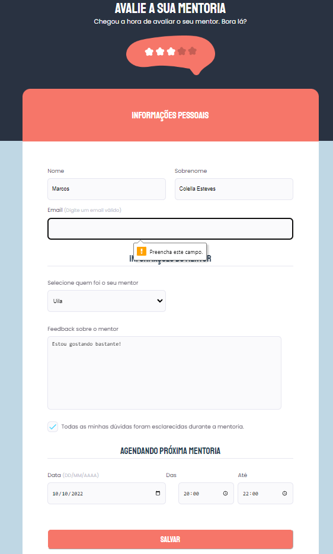

## Projeto 03 (desafio) Rocketseat - Explorer
O desafio era desenvolver o formulário do zero a partir de um design feito no Figma, agora com um campo Select e uma Checkbox totalmente editada.
### [Clique aqui para ver o projeto](https://colelladev.github.io/RocketProjeto03b-Formulario/)

